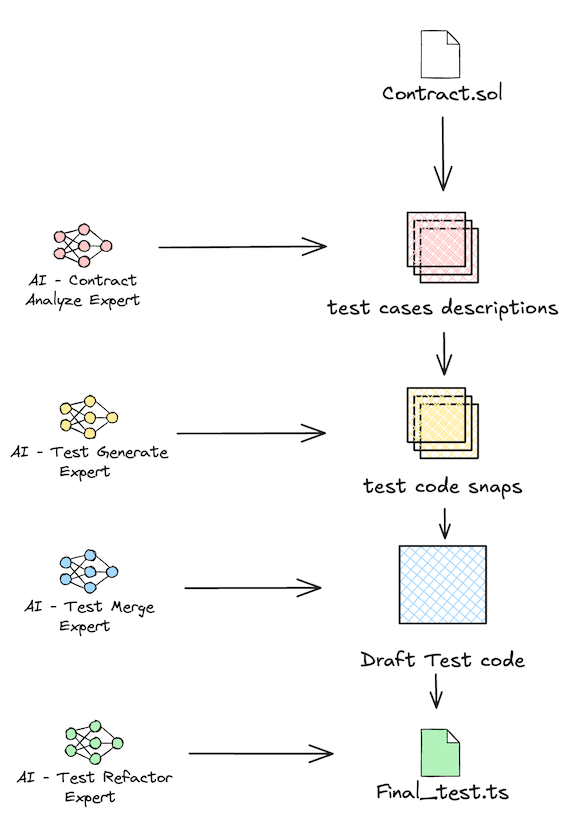

# Contract Test Forge (CTF)

CTF is a command-line tool that helps you generate comprehensive test cases for Solidity smart contracts using AI. It analyzes your contract functions and generates TypeScript test files using Hardhat and ethers.js.

## Features

- 🔍 Automatic contract function analysis
- 🤖 AI-powered test case generation
- ✨ TypeScript support with proper type annotations
- 🧪 Hardhat and ethers.js integration
- 📝 Comprehensive test coverage
- 🚀 Easy to use CLI interface



## Installation

You can install CTF in two ways:

### 1. Using Binary (Recommended)

Download the appropriate binary for your system:

- Linux (AMD64): `ctf_linux_amd64`
- macOS (ARM64/M1/M2): `ctf_darwin_arm64`

Make the binary executable:

```bash
chmod +x ctf_linux_amd64 # or ctf_darwin_arm64
```

### 2. From Source

#### Clone the repository

```bash
git clone https://github.com/your-username/contract-test-forge.git
cd contract-test-forge
```

#### Install dependencies

```bash
npm install
```

#### Build the project

```bash
npm run build
```

#### Link the package globally (optional)

```bash
npm link
```

## Configuration

### 1. Initialize CTF in the example project:

```bash
cd examples/eth
ctf init
```

### 2. Configure your OpenAI API key in `.ctf/ai.yaml`:

```yaml
model: "gpt-4o" # or your preferred model
api_key: "your-api-key-here"
```

## Usage

### Generate Test Cases

Generate test cases for a specific contract:

```bash
ctf gent -f Faucet.sol
```

Generate test cases for a specific method:

```bash
ctf gent -f Faucet.sol -m withdraw 
```

Auto-confirm test cases:

```bash
ctf gent -f Faucet.sol -y
```

Then the test cases will be generated in the `test` directory.

### Project Structure

```
your-project/
├── contracts/ # Your Solidity contracts
├── test/ # Generated test files
├── .ctf/ # CTF configuration
│ ├── project.yaml # Project configuration
│ └── ai.yaml # AI configuration
```

## Test File Structure

Generated test files follow this structure:

- Import statements for required dependencies
- Contract deployment fixtures
- Test cases grouped by method
- Proper TypeScript types and async/await syntax

Example:

```typescript
import { expect } from "chai";
import { ethers } from "hardhat";
import { Contract, SignerWithAddress } from "ethers";

describe("YourContract", () => {
  let contract: Contract;
  let owner: SignerWithAddress;

  beforeEach(async () => {
    // Setup code...
  });

  describe("methodName", () => {
    it("should handle valid input", async () => {
      // Test implementation...
    });
  });
});
```

## Development

### Building from Source

#### Install dependencies

```bash
npm install
```

#### Compile TypeScript

```bash
npm run build
```

#### Create binaries

```bash
npm run pkg
```

### Project Structure

```
src/
├── command/ # CLI commands
├── lib/ # Core functionality
├── types.ts # TypeScript types
├── constants.ts # Constants
└── index.ts # Entry point
```

## Contributing

Contributions are welcome! Please feel free to submit a Pull Request.

## License

This project is licensed under the MIT License - see the LICENSE file for details.
